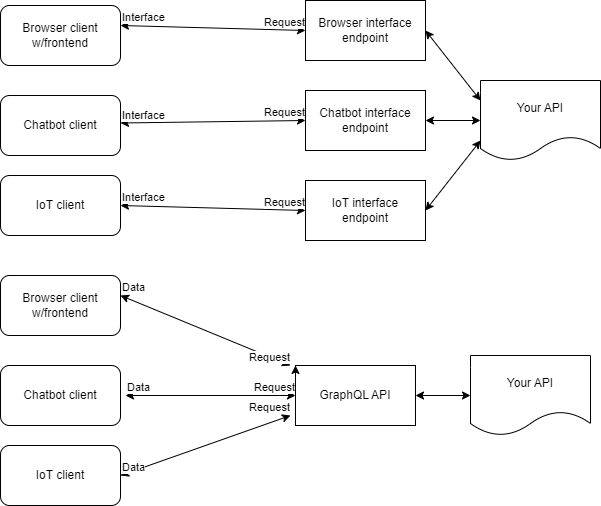
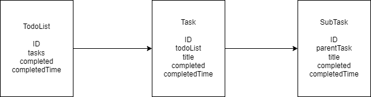
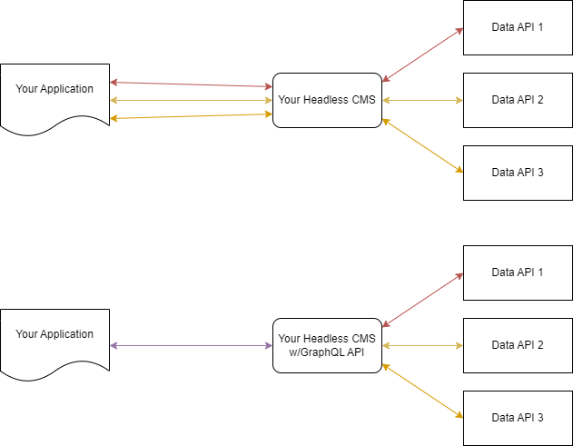

# Moving from Web CMS to Headless CMS: Best Practices

Headless CMSs have changed how we think of content in websites; instead of focusing on the interface, we're more interested in APIs and data modelling. 

For those new to the discussion, a **Headless CMS is a Content Management System that does not posses a rendering engine**, meaning instead of rendered content, you recieve raw data at the interface level, usually in a JSON format.

As you navigate this space, it can be hard to find signposts on the road from traditional web CMSs to headless. I've gathered some best practices for those making the jump; think of it less as a detailed map and more a list of landmarks on your journey.

I'll start with the biggest change, and this stems from the main difference between headless and web CMSs: thinking about how you model content.

## Model content, not interface

In the modern web, your content could be called from a litany of interfaces: a traditional web app in a browser, a chatbot in Slack, an IoT device in a retail store. These devices have radically different interfaces, so it pushes you to think about your content more agnostically.

This will benefit you in the long run by reducing the number of requests your application needs to make and creating a unified API your team can iterate on rapidly.

Designing a content schema for a headless system can be a lot like designing an API, and luckily for us there's a bounty of literature on that subject; I recommend [this FreeCodeCamp article](https://www.freecodecamp.org/news/rest-api-best-practices-rest-endpoint-design-examples/) for REST APIs, and [this article from GraphQL](https://graphql.org/learn/best-practices/) for GraphQL as a start.

Desiging content for headless systems can be a lot like designing a database schema; you can model your data in a diagram with fields and relationships, like this example for a todo list:

If you're interested in learning more about modelling content specifically for headless CMSs, check out [this article from Stackbit](https://www.stackbit.com/blog/content-modeling-headless) and [this article from ContentStack](https://www.contentstack.com/blog/all-about-headless/content-modeling-and-headless-cms/).

### Reuse, reuse, reuse

One of the main points of a headless CMS is the separation of data from presentation and interface. This allows some really great content reuse; and in fact, demands it.

Say you're building a content piece for a banner that has 4 different interfaces. In a traditional CMS, you would model all of them separately, and if a change needed to be made, it had to be made everywhere.

With a headless CMS, you *could* create a different endpoint for each interface...or you could re-use the endpoint 4 times, with the same data. This means if you need to make a change to all 4 banners, only 1 piece of content needs to be changed.

Keep reusability in mind when planning a headless CMS project-- it's one of the biggest gains of using headless.

What happens when you want to model for content instead of interface? You start building APIs and user interfaces in tandem; content drafts go into the front end for design right away. This naturally leads to my next tip: making your content cross-functional.

## Make your content cross-functional

Diverse teams produce better results, and this is true of job function diversity as well; more people who do different things for a living bring new perspectives to your content. Good content is rarely produced in a vacuum, so having input from other teams is a huge boon in your content development.

What does it mean to make your content cross-functional? Some main pointers are:

- Put your content in your CMS early and let developers use it to create the interface during development
- Foster a culture of input and discussion around content; make it easy for anyone to suggest changes.
- When you write content for an audience, reach out to colleauges near that function. Writing a technical callout? Reach out to Engineering or Developer Relations or even Solutions Engineering

Making your content cross-functionally accessible benefits your org by letting more perspective shine through in your content.

Keeping up with changes from within the organization and product is a large chunk of any engineer's work. But how can you prepare for change?

## Be future-friendly

New interfaces arrive on a regular basis; from browsers to command-line tools, dashboards to IoT devices. Tomorrow you could be asked to build a chatbot! In this fast-moving environment, one way to help yourself and your team is to be future-friendly when designing your headless CMS setup.

The main concept is to keep your content, and the API developers use to get it, as flexible as possible. This hearkens back to the "design content, not interfaces" section; designing your API to produce interface-agnostic content. the easier it will be to adapt.

Another tip: **API consistency is key.** Whether this means versioning [a la Stripe](https://stripe.com/blog/api-versioning), using consistent naming for endpoints and arguments, anything you can do to make your API more consistent not only makes development easier (read: faster), but makes your API ready to flex should (when) the need arises.

One last tip: **use standards-based tech whenever possible**: standards are clear about changes and developers can use them more easily than proprietary or self-made tech. This includes shipping your data in JSON, not sending arbitrary data without formatting, etc.

A big part of being future-friendly is being able to quickly make changes. It's hard to do that when your data comes from several different places. This leads to my next point, consolidating your data.

## Consolidate your data

When your data and content are split across several locations, it slows down a lot of things. For instance, if you need to make 5 calls from your application to different servers to serve a piece of content, those request times add up to a slow load. 

Having content in lots of places also increases development time for your content interfaces; developers will need to look up locations more, remember possibly different API naming schemes, etc.

The key here is to **consolidate your data behind as few external calls as possible**. This decreases page load and development time, generally. This is because you make fewer requests the more your data is consolidated.

Once you've consolidated your data, it can be really fun to abstract things out and create heirarchies; but a word of caution: there's a delicate balance to keep an eye on when working with abstractions.

### Keep an eye on abstraction

While abstractions can be a great design move, you'll want to keep an eye on ease of use as the abstractions grow-- one of the main benefits of using a headless CMS is it lets developers work quickly. **If you abstract too much, this benefit can get wiped away**, so always ask yourself what the user of an API would get out of an abstraction.

---

Hopefully you've picked up a few tips for making the move to a headless CMS; and if this was TL;DR and you scrolled down to find a summary, you're in the right place.

## Summing it up

There are a lot of things to consider when moving from a traditional web CMS to a headless CMS. Here are just a few best practices to keep in mind:

- Think about content over interface
- Reuse, reuse, reuse that content
- Let everyone see and use your content early to encourage cross-functional engagement
- Think about the future and act in the present
- Bring your content into one living source of truth
- Abstraction is great! So is ease of input and editing.

Thanks for reading!